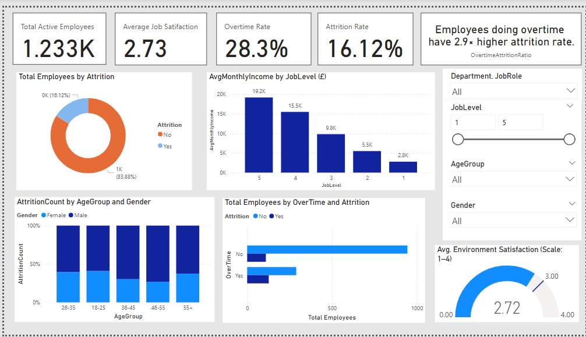

# HR Analytics Dashboard (Power BI + Python)

## Overview
This project presents an HR analytics dashboard created using **Power BI**, with all data pre-processed and cleaned in **Python**. The goal is to uncover key HR insights related to attrition, compensation, work satisfaction, and employee demographics.

> Dataset from Kaggle 
---
There are key objectives for the HR team that need to be met :

- Identify **potential drivers of attrition**
- Understand how **demographics and job roles** affect satisfaction and turnover
- Ensure performance is kept up
- Evaluate **compensation fairness** across job levels
- Empower decision-making through an interactive, data-driven report

## Dashboard Preview

 
---
## Dashboard insights:
Based on the department-level insights, demographic, and behavioural analysis, these key insights are found : 

- Employees doing overtime are nearly 3× more likely to leave, with the highest overtime attrition impact seen in Research & Development (3.2×).
- Overtime is most common in Sales (28.7%), further amplifying its attrition risk. 
- Attrition is highest among employees aged 26–35, especially in specific roles.
- Research & Development reports higher job satisfaction  and lower attrition rates.
- Monthly income increases with job level, confirming role-based compensation fairness.
- Overall environment satisfaction averages below the target score of 3.0, highlighting a potential area for improvement.
- HR shows the lowest job satisfaction (2.60), indicating a potential engagement gap for further investigation.
-Male employees in the 26–45 age range drive the majority of attrition across the company, with early-career exits also high across both genders

---

## 🗃️ Dataset Summary
- **Source**: Provided CSV file (`HR_Analytics.csv`)
- **Rows**: 1,470 employees
- **Columns**: 38 columns covering:
  - Demographics: `Age`, `Gender`, `MaritalStatus`, `AgeGroup`  
  - Compensation: `MonthlyIncome`, `HourlyRate`, `DailyRate`, `SalarySlab`
  - Satisfaction: `JobSatisfaction`, `EnvironmentSatisfaction`, `WorkLifeBalance`, etc.
  - Tenure and experience: `YearsAtCompany`, `YearsWithCurrManager`, `TotalWorkingYears`
  - Status: `Attrition`, `OverTime`

---

## 🛠️ Tools Used
- **Python**: Data cleaning with `pandas`, `numpy`
- **Power BI**: Dashboard development and visualization
- **CSV**: For importing/exporting cleaned datasets

---

## Data Cleaning (`data_cleaning.py`)
The raw data was cleaned and prepared using Python with the following steps:

- Replaced missing values in `YearsWithCurrManager` with `-1` to indicate unknown
- Dropped constant-value columns:
  - `EmployeeCount`: Same value across all rows
  - `Over18`: Only one value ("Y") — not useful for analysis
- Found that `EmpID` had fewer unique values than total rows, indicating duplicates. Cross-checked with `EmployeeNumber` to confirm duplicate entries.
- Removed fully duplicated rows (identical across all columns)
- Removed partial duplicates by `EmpID`, keeping the first occurrence
- Saved duplicate `EmpID` records for manual review in `potential_conflicts.csv`
- Exported the cleaned dataset as `cleaned_data.csv` for Power BI

---

## ✅ Data Validation (`validate_cleaned_data.py`)
Post-cleaning checks confirmed:
- No missing values remain
- No fully duplicated rows
- `EmpID` is now unique across all entries
- All columns have appropriate data types
- Final dataset contains 1,470 unique employee records

---

## 📈 Power BI Dashboard Features
- **KPI Cards**: 
  - Total Active Employees
  - Average Job Satisfaction
  - Overtime Rate
  - Attrition Rate
  - Insight Card: Dynamic insight (e.g., “Employees doing overtime have 2.9× higher attrition rate”)

- **Visuals**:
  - Donut Chart: Employee attrition status (Yes/No)
  - Bar Chart: Average Monthly Income by Job Level
  - Stacked Column Chart: Attrition count by Age Group and Gender
  - Bar Chart: Total Employees by Overtime Status and Attrition
  - Gauge Chart: Average Environment Satisfaction (scale 1–4) with target value (3)
 
- **Interactive Slicers (affects the whole board) **:
   - Hierarchical Slicer: Department → Job Role
   - Job Level 
   - Age group
   - Gender

---

## Project Files

| File | Description |
|------|-------------|
| `HR_Analytics.csv` | Original raw dataset |
| `data_cleaning.py` | Script to clean and prepare data |
| `validate_cleaned_data.py` | Script to validate final cleaned dataset |
| `cleaned_data.csv` | Final dataset ready for Power BI |
| `potential_conflicts.csv` | Saved duplicate `EmpID` records before resolution |
| `hr_dashboard.pbix` | Power BI dashboard  |

---

---
